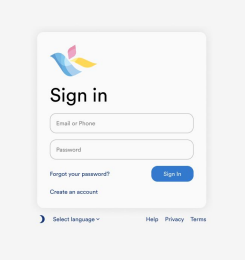
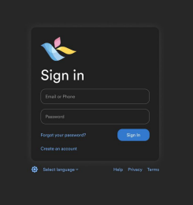

# 
# Frontend Development Task - Sign in Component

### Task

---

&nbsp;&nbsp;&nbsp;&nbsp;&nbsp;&nbsp;&nbsp;&nbsp;

The Assignment is to “Recreate a Sign-in page” based on the [KidsLoop](https://auth.kidsloop.co.uk/?locale=en&continue=https%3A%2F%2Fhub.kidsloop.live%2F%23%2F#/signin)
sign in page

### Functionality

---
#### Text input field types
- Password managers (e.g. Chrome autofill) should detect the input fields
#### Text input validations
- Email validation (invalid email example: me@company)
- Password validation (min length 6 characters)
- Required validation
#### Text input error messages
- Should be able to display multiple error messages simultaneously, at most one for each input field 
#### Send a mock sign in request
- URL: https://my-json-server.typicode.com/kidsloop-test/accounts/sign-in ○ Method: PATCH
- Content type: application/json

Request body:
```json
{
"email": string,
"password": number
}
```

Response body: 
```json
{
    "id": string,
    "name": string,
    "token": {
        "access": string,
        "refresh": string,
        "type": string,
        "expires": number
    },
    "email": string,
    "password": string
}
```

#### Progress indicator
- Display a progress indicator when the sign in request is processing (some brief timeout is sufficient) 
#### Success message
- After a successful request, print in the console the message `“Welcome, ${name}!”` 
- Use the name from the response body
#### Dark / light theme toggle
- Switch between two icons
- Consider dark and light theme colors
#### Language select
- Implement at least 2 languages
- At least one string should be translated and should dynamically change when the language select changes 
#### Accessibility
- Consider WAI-ARIA standards

### Design 

---

#### UI library
- You may use any UI component library to speed up development
#### Rounded elements
- All elements should have rounded edges of a border radius of 12 pixels
#### Card alignment
- The card should be centered, vertically and horizontally, in the middle of the page, on any display resolution 
#### Element alignments
- Elements such as “Forgot your password?” and “Sign In”, should be vertically centered in the same row 
#### KidsLoop logo
- Download from Google Drive here: [kidsloop_min_logo.svg](https://drive.google.com/file/d/1wgombEnnLMUlJC3bqytzds2WjOw5RrXA/view)

| Color palette    |    Light theme     |     Dark theme     |
| ---------------  | ------------------ | ------------------ |
| Text             | `#000`             | `#fff`             |
| Background       | `#f5f5f5`          | `#272727`          |
| Card             | `#fafafa`          | `#212121`          |
| Primary          | `#3379ce`          | `#3379ce`          |
| Secondary        | `#17377b`          | `#77b0f4`          |
| Label Text       | `#000 (50% alpha)` | `#fff (50% alpha)` |
| Input border     | `#000 (25% alpha)` | `#fff (25% alpha)` |
| Card drop shadow | `#000 (10% alpha)` | `#fff (10% alpha)` |

#### Card drop shadow specifications:
- X offset: 0 pixels
- Y offset: 0 pixels
- Blur radius: 20 pixels
- Spread radius: 5 pixels

Any unspecified elements (error messages, progress indicator, etc) are required to be implemented, but the design is up 
to the developer’s own discretion


- Card padding: 24 pixels
- Card item spacing: 12 pixels
- Margin between Card and Footer: 12 pixels
- Footer item spacing: 12 pixels
- Default font size: 11 pixels
- Title font size: 36 pixels
- Card max width: 320 pixels

## Project setup
### Starting up the project by running: 
```
$ npm run serve
```
## My process

### Built with

- Vue Js SFCs
- CSS
- Flexbox
- CSS Grid

## Future additions and improvements

When coming back to this project areas that I would like to focus on, features, refactoring and additions that I would make are:

- Improvements on the file structure 
- Breaking up the components further to increase re-usability
- Implementing a library to actually change the language on the page
- Change the theme toggle to go from updating the dom to saving the selected theme to local storage so the data persist
- Add in ESLint and configure to use vue recommended rules 
- Add in gradient background: 
`$top-right: #fef4fb`
`$top-left: eff8fa`
`$bottom-right: #f8e8e7`
`$bottom-left: #d7ddf7`
